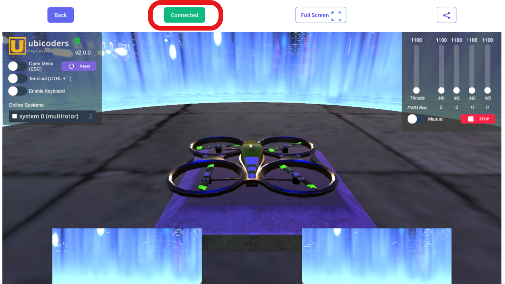

# Ubicoders Virtual Robot - Multirotor

The virtual robot is here:
[Virtual Multitor](https://www.ubicoders.com/virtualrobots/multirotor
) 


Requirements:
- Python 3

## Once you have Python 3

```
pip install ubicoders-vrobots matplotlib numpy
```

## Turn on Virtual Robots Bridge
```
python start_bridge.py
```

## Connect the Virtual Robot 


## Run the template script
```
python VRTemplate.py
```

## Axis Convention
x front, y right, z down.

## Units

### actuators.pwm 
Integer representing micro seconds. The range between 1100 to 2000 microseconds. This range is a typical operation range of ESC of the actual drones.

### sensors.acc
Raw accelerometer values for x, y, and z axis. 1g (9.8m/s^2) represents 16384. 

- Conversion to m/s^2: (sensor.acc)*9.81/16384


### sensor.gyro
250 deg/second for 32768. To convert to radians per second

- Conversion to rad/sec = (sensor.gyro) * 250/32768 * pi/180

### sensor.mag
in micro Tesla (uT)

### states.angularVelocity
in radians per second (rad/s)

### states.eulerAngles
in degrees (deg)

### states.linearVelocity
in meters per second (m/s)

### states.position
in meters (m)